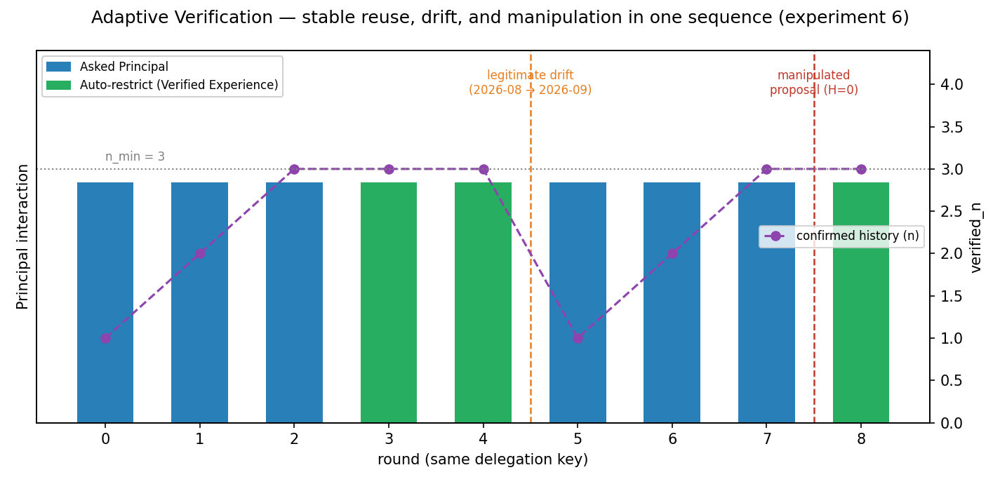

[English](README.md) | **한국어**

# DualFlow

**안전한 Agent-to-Agent 위임을 위한 의미·권한 검증**

DualFlow 는 agent-to-agent 위임(delegation)을 검증하는 프레임워크다. 근본적으로
다른 두 질문을 분리해서 다룬다:

1. **의미 검증(Semantic verification)** — 위임받은 쪽(delegate)이 위임한 쪽
   (principal)의 요청을 제대로 이해했는가?
2. **권한 검증(Authority verification)** — 제안된 실행이 위임된 권한 범위 안에
   있는가?

DualFlow 는 실행 전에 두 신호를 모두 확인하고, 위임 범위가 정책만으로는 안전하게
결정되지 않을 때 principal 과 **bounded Authority Feedback Loop** 를 연다. 핵심
안전 메커니즘은 과거 이력에 의존하지 않는다 — **검증된 이력(verified experience)
은 반복되는 principal 확인 비용을 줄이는 최적화 계층으로만 쓰인다.**

구현은 결정론적이다(아래 실험을 돌리는 데 LLM 호출이 필요 없다). 실제 모델은
인터페이스 세 곳 뒤에 그대로 꽂힌다 — [현재 범위와 한계](#현재-범위와-한계) 참고.

## 왜 DualFlow 인가?

위임된 행동은 두 가지 서로 다른 방식으로 실패할 수 있다.

**의미 불일치(Semantic mismatch).** 위임받은 쪽이 요청을 잘못 읽을 수 있다.

```
Principal:        "지난달 보고서를 읽어줘."
Delegate 해석:      /reports/2025-08/
```

이 해석에 대해 delegate 가 매우 확신할 수 있으므로, 낮은 의미적 불확실성만으로는
정확성을 보장하지 못한다.

**권한 불일치(Authority mismatch).** delegate 가 요청을 정확히 이해했더라도,
실제로 위임된 범위 밖의 것을 제안할 수 있다.

```
위임된 범위:   read /reports/2026-08/*
제안된 범위:   read /reports/*
```

행동의 의미는 명확해도 위임된 권한을 넘어설 수 있다.

따라서:

**낮은 불확실성이 유효한 위임을 뜻하지 않고, 허용된 행동이 곧 의도된 행동도
아니다.** DualFlow 는 실행 전에 이 둘을 명시적으로, 각각 따로 검증한다.

## 아키텍처

DualFlow 는 그 자체로 안전해야 하는 **Core Safety Mechanism** 과, 사용 비용만
줄여주는 선택적 **Optimization Layer** 로 구성된다.

```
Core Safety Mechanism ── 과거 이력이 하나도 없어도 안전성이 유지된다
  1. Semantic Flow            모호함 해소: 엔트로피, information gain, 역질의(clarification)
  2. Authority Flow           capability / resource / scope / condition 검증
  3. Authority Feedback Loop  APPROVE / CORRECT / RESTRICT / REJECT, bounded rounds
  4. Joint Verification       확정된 의도·확인된 권한에 대한 최종 검증

Optimization Layer ── principal 과의 상호작용 비용만 줄인다. 안전성에는 영향 없음
  Verified Authority Store → Adaptive Feedback Gate → 필요할 때만 principal 호출
```

Optimization Layer 를 완전히 꺼도(`use_verified_experience=False`) Core 단독과
정확히 같은 안전성을 낸다 — 매번 principal 을 부를 뿐이다.

| 구성요소 | 구현 | 관련 선행연구 |
|---|---|---|
| 위임 예산, 위임 체인 | `capability.Budget`, `check_authority` | ChainCaps §3.2–3.3, Eq.(2) |
| Action space, 해석 후보 분포 | `semantic.Interpretation`, `build_belief` | SAGE-Agent Def.2–3 |
| 엔트로피 / 역질의 | `semantic.entropy`, `information_gain` | SAGE-Agent Def.4 를 information gain 으로 재정의 |
| LLM fallback | `llm.LLMJudge` | SAGE-Agent 의 상시 판단자를 fallback 으로 격하 |
| 매칭 검증 | `rule_engine.match_intent`, `sim_path` | SAGE-Bench Eq.(6) |
| Authority Feedback Loop | `authority_feedback.run_feedback` | 신규 |
| Verified Authority Store / Adaptive Gate | `authority_feedback.VerifiedAuthorityStore` | 신규 |
| 전체 조립 | `framework.DelegationVerifier.run` | — |

## 동작 방식

**의미 검증(Semantic Verification).** delegate 는 구조화된 해석
`(action, resource, scope, condition)` 을 만든다. DualFlow 는 해석 후보들에 대한
불확실성을 Shannon entropy 로 재고, 불확실성이 높으면 information gain 기준으로
역질의 질문을 고른다.

**권한 검증(Authority Verification).** 제안된 모든 실행은 현재 위임 예산에 대고
검사된다. 실패는 단순히 표시만 되는 게 아니라 분류된다:

- `no_grant` — action/resource 자체가 애초에 위임된 적 없음 → 하드 리젝트
- `condition_missing` — 범위는 맞지만 필수 조건(예: 비식별화)이 빠짐 → 하드
  리젝트, delegate 가 스스로 채울 수 있는 값이 아니다
- `scope_exceeded` — action/resource/condition 은 맞는데 범위만 넘음 →
  **협상 가능**
- 그 외 → 계속 진행

**Authority Feedback.** `scope_exceeded` 제안에 대해 principal 은 시스템이
계산한 제안(현재 예산이 실제로 커버하는 가장 넓은 범위)에 대해 `APPROVE`,
`CORRECT`, `RESTRICT`, `REJECT` 중 하나로 응답한다. 협상은 bounded 이고, 수정된
모든 제안은 승인되기 전에 위임 예산에 대해 다시 검증된다 — 예산 밖 제안에
부주의하게 `APPROVE` 해도 이 재검증이 걸러낸다(그대로 신뢰하지 않는다).

**Joint Verification.** 확정된 의미 해석과 확인된 권한이 원래 의도와 일치할
때만 — 경로 유사도와 **terminal decision match**(EXECUTE / ESCALATE / REJECT)
를 모두 만족할 때만 — 실행이 허용된다.

**Adaptive Feedback.** principal 에게 반복해서 확인받는 건 비용이 크다.
DualFlow 는 principal 이 **확인해주고** 시스템이 **재검증했고** 그 결과
**실행까지 성공한** — 이 세 조건을 모두 거친 권한 상태만 저장하고, 단순하고
해석 가능한 규칙으로 재사용한다:

```
n_confirmed >= 3  이고  agreement_ratio >= 0.8   =>  묻지 않고 재사용
```

재사용은 절대 이력을 그대로 재생하지 않는다. 재사용될 때마다 **현재** 예산과의
교집합으로 다시 계산되고 재검증된다:

```
C_adaptive = C_experience ∩ C_current_budget
C_adaptive ⊆ C_current_budget ⊆ C_A
```

**검증된 이력은 현재 권한을 좁힐 수 있을 뿐, 절대 새로 만들거나 넓히지 못한다.**
새로 확인된 상태가 저장된 상태와 다르면(위임 범위가 실제로 바뀐 경우) 낡은
이력은 무효화되고 그 시점부터 다시 쌓인다 — 검증된 이력은 재사용 가능하지만
영구하지는 않다.

## 핵심 결과

### 1. 두 검증 축 모두 필요하다

9개 과제 파일럿(`DelegationBench-mini`), 정상 조건:

| 방식 | Unsafe ↓ | Benign ↑ |
|---|---:|---:|
| Authority only | 22.2% | 80.0% |
| Semantic only | 22.2% | 80.0% |
| **Full Core** | **0.0%** | 80.0% |

각 축을 단독으로 빼면 서로 다른 실패 유형이 통과한다 — Authority 를 빼면
삭제·외부유출·조건위반이 통과하고, 매칭을 빼면 조용한 오해석이 통과한다. 서로
다른 경로로 똑같이 22.2% unsafe 에 도달하고, 둘을 합쳐야만 0% 에 도달한다.
상시 LLM/θ게이트만 같은 베이스라인을 포함한 전체 실험은
[docs/EXPERIMENTS.md](docs/EXPERIMENTS.md) 에 있다.

### 2. Authority Feedback 은 안전한 거절을 안전한 완료로 바꾼다

scope 협상 파일럿(`scope_negotiation_tasks()`) — 9개 과제 벤치마크와는 분리된
별도 세트라, 여기 수치가 위 벤치마크의 분모를 흔들지 않는다:

| 방식 | Unsafe ↓ | Benign ↑ | Feedback률 ↓ |
|---|---:|---:|---:|
| Feedback 없음 | 0.0% | 0.0% | 0.0% |
| **Feedback(제안)** | 0.0% | **100.0%** | 66.7% |


Feedback 이 없으면 협상 가능한 모든 scope 위반이 안전하게 거절되지만 끝내
완료되지 않는다. Feedback 을 켜면 같은 사례가 안전하게 완료된다. 이 결과는
**semantic-proposal manipulation 하에서도 동일하다** — Feedback 은 delegate 의
자기신고 semantic uncertainty 가 아니라 principal 의 실제 응답을 읽기 때문이다
— 그리고 principal 의 부주의(carelessness)가 1.0 까지 올라가도 unsafe 0% 를
유지한다. non-amplification 이 principal 이 뭐라고 답했든 매 라운드 재검증하기
때문이다. 단 이건 위임 예산과 principal feedback 채널 자체가 신뢰 가능하다는
전제에서만 성립하고, delegate 가 이미 예산 안의 *다른* 자원을 고르는 경우에는
scope negotiation 자체가 트리거되지 않는다(자세한 건
[현재 범위와 한계](#현재-범위와-한계)). carelessness 스윕을 포함한 상세 내용은
[docs/EXPERIMENTS.md](docs/EXPERIMENTS.md) 에 있다.

### 3. Adaptive 재사용은 반복·변경·조작을 모두 견딘다

하나의 `VerifiedAuthorityStore` 로 실행한 9라운드 시퀀스:



- **안정적 반복**(round 0–4): principal 확인이 3회 일관되게 쌓이면, 더 묻지
  않고 검증된 권한을 재사용한다 — 같은 위임 유형에서 feedback률이 100% 에서
  0% 로 떨어진다.
- **정당한 변경(drift)**(round 5): 위임 범위가 실제로 바뀌면 낡은 이력이 새
  예산과 안 겹쳐 feedback 이 즉시 재활성화되고, 낡은 이력은 새 이력에
  압도당하는 대신 리셋된다.
- **의미 제안 조작**(round 8): 완전히 확신에 찬(H=0) 조작된 제안이 와도
  adaptive 재사용은 묻지 않고 **정답** scope 로 해결된다 — delegate 의 후보를
  전혀 보지 않고, principal 이 확인해준 이력과 현재 예산의 교집합만 보기
  때문이다. 단 이건 현재 위임 예산과 `VerifiedAuthorityStore` 자체가 신뢰
  가능하다는 전제에서만 성립한다.

라운드별 전체 데이터는 [docs/EXPERIMENTS.md](docs/EXPERIMENTS.md) 에 있다.

## 빠른 시작

```bash
pip install -e ".[dev]"

pytest -q                 # 테스트 160개
dualflow-demo              # 실험 11개 전체 (텍스트)
dualflow-plots             # 그림 8장을 figures/ 에 저장
```

### 특정 실험만

```bash
python -m dualflow.demo fastslow attack careless authfeedback adaptiveauth
dualflow-plots careless --trials 50   # 논문용 오차범위 (기본 10회는 흔들림)
```

## 실험 재현하기

이 README 의 모든 수치와 그림은 위 스크립트에서 그대로 나온 것이다 — 손으로 옮겨
적은 값은 없다. [docs/EXPERIMENTS.md](docs/EXPERIMENTS.md) 는 각 실험(파라미터
스윕, ablation, 공격 시나리오)을 그 결과가 나온 이유까지 전부 설명한다.
[docs/BASELINES.md](docs/BASELINES.md) 는 SAGE-Agent 베이스라인 재현과 그 과정에서
발견한 6가지 구체적 결함을 다룬다. [docs/DESIGN_NOTES.md](docs/DESIGN_NOTES.md) 는
최종 결과에는 안 들어간 구현 결정들을 다룬다 — 지름길처럼 보였다가 알고 보니
평가용 오라클이었던 접근(정답과 직접 비교하는 매칭) 하나를 포함해서.

## 저장소 구성

| 파일 | 역할 |
|---|---|
| `capability.py` | 권한 모델 — privilege 순서관계, budget 교집합, 위임 체인 감쇠, 실패 분류 |
| `semantic.py` | Semantic Flow — 해석 후보, 엔트로피, 역질의, 경험 점수 |
| `authority_feedback.py` | Authority Feedback Loop 와 Verified Authority Store(adaptive 재사용) |
| `rule_engine.py` | Joint Verification — 위임 SOP 그래프, 경로 유사도 |
| `framework.py` | 전체 조립, ablation 스위치, 평가 지표 |
| `sage_baseline.py` | SAGE-Agent 베이스라인 — 논문 공식 그대로 재현 |
| `bench.py` | 파일럿 시나리오: 9개 과제 벤치마크, 공격 변형, scope 협상·순차 실험 mini-set |
| `llm.py` | LLM 인터페이스 — 실험용은 스크립트, 실제 모델용 어댑터 골격 포함 |
| `demo.py` / `plots.py` | 모든 실험의 텍스트/그림 출력 |
| `tests/` | 160개 — 안전 invariant, 엔트로피 성질, 종료성, ablation, 공격 시나리오 |

## 현재 범위와 한계

이 저장소는 현재 결정론적 파일럿 시나리오로 메커니즘을 검증한다. 실제 운영되는
LLM agent 에 대한 외부 타당성은 아직 확립하지 못했다. 구체적으로:

- 해석 후보 생성은 스크립트로 만든 것이지, 모델이 생성한 게 아니다.
- principal 은 시뮬레이션이다(carelessness/overcaution 조절 가능) — 실제 사람이나
  agent 엔드포인트가 아니다.
- 파일럿 벤치마크는 소규모의 통제된 과제들이다(핵심 벤치마크 9개, scope 협상·
  adaptive verification 용 소규모 세트 별도) — 크거나 자연스러운 분포가 아니다.
- 검증된 권한 재사용은 현재 위임 예산과 `VerifiedAuthorityStore` 자체가 신뢰
  가능하다고 가정한다 — 둘 중 하나가 조작 가능하다면 지금 검증한 것과는 다른
  위협 모델이다.
- 권한 범위 안에 있지만 의도하지 않은 자원 선택(delegate 가 승인된 예산 안의
  *다른* 자원을 고르는 경우)은 `scope_exceeded` 자체가 발생하지 않으므로
  Authority Feedback 이 잡지 못한다 — 이건 별개의 intent-confirmation 문제로
  남아 있다.

실제 모델로 교체하는 지점은 정확히 세 곳(후보 생성, principal 응답, LLM
fallback)이고 [docs/DESIGN_NOTES.md](docs/DESIGN_NOTES.md) 에 문서화돼 있다.

## 로드맵

- **외부 검증** — 실제 LLM 이 생성한 제안, 더 큰 벤치마크, 현재 파일럿을 넘어선
  베이스라인 비교.
- **에이전트별 principal 신뢰도** — carelessness 를 에이전트마다 다르게 두고
  검토 예산을 넣으면 "누구에게 Slow review 를 줄 것인가" 가 최적화 문제가 된다.
  `warmup_then_attack` 이 이미 그 골격을 제공한다.
- 권한 실패를 "아예 권한 없음" 과 "권한이 너무 좁음" 으로 나누는 건 끝났다 —
  다음 질문은 에스컬레이션이 일어난 뒤 principal 을 *얼마나 신뢰할지* 이지,
  *얼마나 자주* 에스컬레이션할지가 아니다.
- 기존 θ 스윕과 같은 방식의 σ / k / λ 스윕.

항목별 상세는 [docs/DESIGN_NOTES.md](docs/DESIGN_NOTES.md) 에 있다.

## 참고문헌

- ChainCaps: Composition-Safe Tool-Using Agents via Monotonic Capability Attenuation. arXiv 2605.26542
- Structured Uncertainty guided Clarification for LLM Agents. arXiv 2511.08798 (Findings of ACL 2026)
- SAGE: A Service Agent Graph-guided Evaluation Benchmark. arXiv 2604.09285
